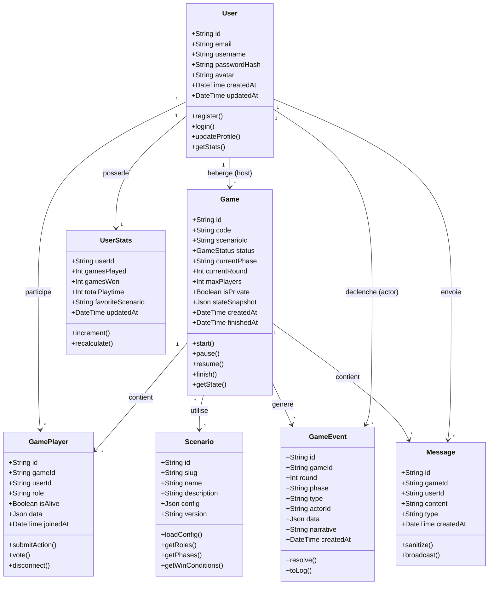
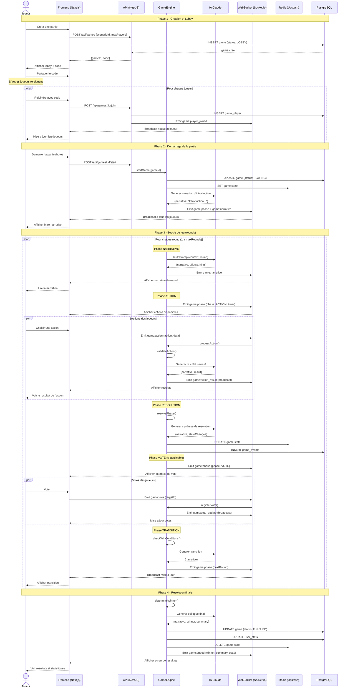
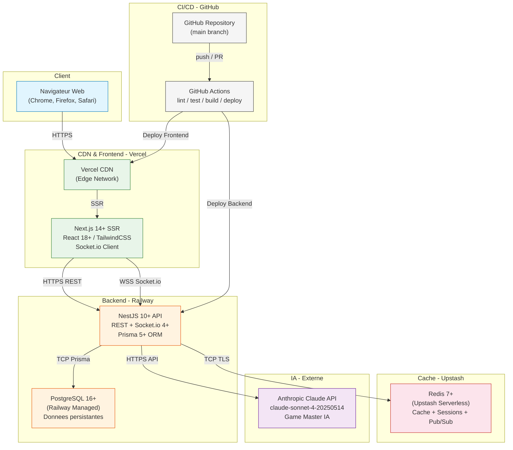
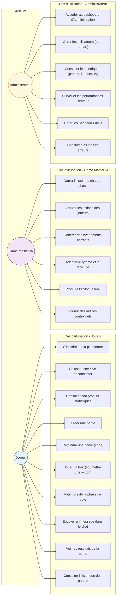

# MYTHOS - Specifications Techniques

> Plateforme web de jeux narratifs multijoueurs avec Maitre du Jeu IA
> Version 1.0 | 11 Fevrier 2026

> L'architecture a ete posee par Kays et on l'a validee tous ensemble pendant un atelier technique en semaine 1. Samy avait d'abord propose Express au lieu de NestJS, mais apres avoir compare les deux sur un mini-POC, on est tous tombes d'accord sur NestJS. Les choix techno (NestJS, Socket.io, Prisma) ont ete confirmes par nos trois POCs du Sprint 0.

---

## 1. Architecture Globale

```
+------------------+       +-------------------+       +------------------+
|   CLIENT         |       |   SERVICES CLOUD  |       |   DONNEES        |
|                  |       |                   |       |                  |
| Next.js 14+ SSR  | HTTPS | NestJS 10+ API    | TCP  | PostgreSQL 16+   |
| React 18+       +------>+ REST + WebSocket   +----->+ (Railway)        |
| TailwindCSS     |       |  (Railway)        |       |                  |
| Socket.io Client|  WSS  |                   |  TCP  | Redis 7+         |
| (Vercel)        +------>+ Socket.io 4+      +----->+ (Upstash)        |
|                  |       |                   |       |                  |
+------------------+       | Prisma 5+ ORM    |       +------------------+
                           |                   |
                           | Anthropic Claude  +------> API Claude
                           +-------------------+
```

### Flux de donnees principal
```
Joueur -> Next.js (Vercel) -> NestJS (Railway) -> PostgreSQL (Railway)
                                    |                    ^
                                    v                    |
                              Redis (Upstash)     Prisma ORM
                                    |
                              Claude API (IA MJ)
```

---

## 2. Architecture Backend (NestJS)

```
src/
+-- app.module.ts
+-- modules/
|   +-- auth/          # JWT, guards, strategies
|   +-- users/         # Profils, stats
|   +-- games/         # CRUD parties, lobby
|   +-- engine/        # Boucle 6 phases, logique jeu
|   +-- scenarios/     # Chargement Scenario Packs
|   +-- websocket/     # Gateway Socket.io
|   +-- ai/            # Integration Claude API
|   +-- cache/         # Service Redis/Upstash
+-- common/
|   +-- guards/        # AuthGuard, RolesGuard, RateLimitGuard
|   +-- pipes/         # ValidationPipe, SanitizePipe
|   +-- interceptors/  # LoggingInterceptor, TimeoutInterceptor
|   +-- filters/       # HttpExceptionFilter
+-- prisma/
    +-- schema.prisma
    +-- migrations/
```

---

## 3. Architecture Frontend (Next.js)

```
app/
+-- (auth)/
|   +-- login/page.tsx        # Connexion
|   +-- register/page.tsx     # Inscription
+-- (main)/
|   +-- dashboard/page.tsx    # Accueil, parties recentes
|   +-- games/
|   |   +-- page.tsx          # Liste parties
|   |   +-- [id]/page.tsx     # Lobby
|   |   +-- [id]/play/page.tsx # Interface de jeu
|   +-- profile/page.tsx      # Profil utilisateur
+-- components/
|   +-- game/
|   |   +-- GameBoard.tsx     # Zone principale
|   |   +-- NarrativePanel.tsx # Narration IA
|   |   +-- PlayerList.tsx    # Joueurs connectes
|   |   +-- ActionPanel.tsx   # Actions disponibles
|   |   +-- PhaseTimer.tsx    # Timer de phase
|   |   +-- ChatPanel.tsx     # Chat en jeu
|   |   +-- ResourceGauge.tsx # Jauges (DEEP)
|   |   +-- VotePanel.tsx     # Vote (TRIBUNAL)
|   +-- ui/                   # Composants generiques
+-- hooks/
|   +-- useSocket.ts          # Connexion WebSocket
|   +-- useGameState.ts       # Etat de jeu reactif
+-- lib/
    +-- api.ts                # Client HTTP
    +-- socket.ts             # Instance Socket.io
```

---

## 4. API REST

### 4.1 Authentification

| Methode | Endpoint | Auth | Description |
|---------|----------|------|-------------|
| POST | `/api/auth/register` | Non | Inscription |
| POST | `/api/auth/login` | Non | Connexion |
| POST | `/api/auth/refresh` | Oui | Rafraichir token |

**POST /api/auth/register**
```json
// Body
{ "username": "player1", "email": "p1@mail.com", "password": "Str0ng!Pass" }
// 201 Created
{ "id": "uuid", "username": "player1", "accessToken": "jwt...", "refreshToken": "jwt..." }
// Erreurs: 400 (validation), 409 (email/username existe)
```

**POST /api/auth/login**
```json
// Body
{ "email": "p1@mail.com", "password": "Str0ng!Pass" }
// 200 OK
{ "accessToken": "jwt...", "refreshToken": "jwt...", "user": { "id": "uuid", "username": "player1" } }
// Erreurs: 401 (identifiants invalides)
```

### 4.2 Utilisateurs

| Methode | Endpoint | Auth | Description |
|---------|----------|------|-------------|
| GET | `/api/users/me` | Oui | Profil courant |
| PATCH | `/api/users/me` | Oui | Modifier profil |
| GET | `/api/users/:id/stats` | Oui | Stats joueur |

**GET /api/users/me** -> `200`
```json
{ "id": "uuid", "username": "player1", "email": "p1@mail.com", "gamesPlayed": 12, "createdAt": "2026-01-15T10:00:00Z" }
```

### 4.3 Parties

| Methode | Endpoint | Auth | Description |
|---------|----------|------|-------------|
| POST | `/api/games` | Oui | Creer partie |
| GET | `/api/games` | Oui | Lister parties |
| GET | `/api/games/:id` | Oui | Detail partie |
| POST | `/api/games/:id/join` | Oui | Rejoindre |
| POST | `/api/games/:id/start` | Oui | Demarrer (hote) |
| GET | `/api/games/:id/state` | Oui | Etat courant |

**POST /api/games**
```json
// Body
{ "scenarioId": "TRIBUNAL", "maxPlayers": 6, "isPrivate": true }
// 201 Created
{ "id": "uuid", "code": "ABCD12", "scenarioId": "TRIBUNAL", "status": "LOBBY",
  "hostId": "uuid", "maxPlayers": 6, "players": [{ "id": "uuid", "username": "player1", "role": null }] }
// Erreurs: 400 (validation), 404 (scenario inconnu)
```

**POST /api/games/:id/join**
```json
// Body
{ "code": "ABCD12" }
// 200 OK
{ "gameId": "uuid", "playerId": "uuid", "status": "LOBBY", "players": [...] }
// Erreurs: 403 (partie pleine/privee), 404 (partie introuvable), 409 (deja rejoint)
```

### 4.4 Scenarios

| Methode | Endpoint | Auth | Description |
|---------|----------|------|-------------|
| GET | `/api/scenarios` | Oui | Lister packs |
| GET | `/api/scenarios/:id` | Oui | Detail pack |

---

## 5. API WebSocket (Socket.io)

### Evenements Client -> Serveur

| Evenement | Payload | Description |
|-----------|---------|-------------|
| `game:join` | `{ gameId, token }` | Rejoindre room |
| `game:leave` | `{ gameId }` | Quitter room |
| `game:action` | `{ gameId, action, data }` | Action de jeu |
| `game:vote` | `{ gameId, targetId }` | Voter |
| `game:chat` | `{ gameId, message }` | Message chat |
| `game:ready` | `{ gameId }` | Joueur pret |

### Evenements Serveur -> Client

| Evenement | Payload | Description |
|-----------|---------|-------------|
| `game:state` | `GameState (complet)` | Etat synchronise |
| `game:phase` | `{ phase, round, timer }` | Changement phase |
| `game:narrative` | `{ text, speaker, type }` | Narration IA |
| `game:action_result` | `{ playerId, action, result, narrative }` | Resultat action |
| `game:vote_update` | `{ votes: { oderId: targetId } }` | Mise a jour votes |
| `game:player_joined` | `{ player: { id, username } }` | Nouveau joueur |
| `game:player_left` | `{ playerId }` | Joueur parti |
| `game:chat_message` | `{ playerId, username, message, ts }` | Message recu |
| `game:ended` | `{ winner, summary, stats }` | Fin de partie |
| `game:error` | `{ code, message }` | Erreur |

**Exemple flux action:**
```json
// Client envoie
{ "event": "game:action", "data": { "gameId": "uuid", "action": "INVESTIGATE", "data": { "targetId": "uuid-player2" } } }
// Serveur repond (broadcast)
{ "event": "game:action_result", "data": { "playerId": "uuid", "action": "INVESTIGATE",
  "result": { "success": true, "evidence": "PARTIAL" },
  "narrative": "L'avocat examine les preuves..." } }
```

---

## 6. Schema Base de Donnees

### Tables

**users**
| Colonne | Type | Contraintes |
|---------|------|-------------|
| id | UUID | PK, DEFAULT uuid_generate_v4() |
| username | VARCHAR(30) | UNIQUE, NOT NULL |
| email | VARCHAR(255) | UNIQUE, NOT NULL |
| password_hash | VARCHAR(255) | NOT NULL |
| created_at | TIMESTAMPTZ | DEFAULT NOW() |
| updated_at | TIMESTAMPTZ | DEFAULT NOW() |
> Index: `idx_users_email` (email), `idx_users_username` (username)

**games**
| Colonne | Type | Contraintes |
|---------|------|-------------|
| id | UUID | PK |
| code | VARCHAR(6) | UNIQUE, NOT NULL |
| scenario_id | VARCHAR(50) | NOT NULL |
| status | ENUM | LOBBY, PLAYING, PAUSED, FINISHED |
| host_id | UUID | FK -> users.id |
| current_round | INT | DEFAULT 0 |
| current_phase | VARCHAR(30) | DEFAULT 'WAITING' |
| max_players | INT | NOT NULL |
| is_private | BOOLEAN | DEFAULT false |
| state_snapshot | JSONB | NULLABLE |
| created_at | TIMESTAMPTZ | DEFAULT NOW() |
| finished_at | TIMESTAMPTZ | NULLABLE |
> Index: `idx_games_code` (code), `idx_games_status` (status), `idx_games_host` (host_id)

**game_players**
| Colonne | Type | Contraintes |
|---------|------|-------------|
| id | UUID | PK |
| game_id | UUID | FK -> games.id, ON DELETE CASCADE |
| user_id | UUID | FK -> users.id |
| role | VARCHAR(50) | NULLABLE |
| is_alive | BOOLEAN | DEFAULT true |
| data | JSONB | DEFAULT '{}' |
| joined_at | TIMESTAMPTZ | DEFAULT NOW() |
> Index: `idx_gp_game` (game_id), `idx_gp_user` (user_id), UNIQUE(game_id, user_id)

**game_events**
| Colonne | Type | Contraintes |
|---------|------|-------------|
| id | UUID | PK |
| game_id | UUID | FK -> games.id, ON DELETE CASCADE |
| round | INT | NOT NULL |
| phase | VARCHAR(30) | NOT NULL |
| type | VARCHAR(50) | NOT NULL |
| actor_id | UUID | NULLABLE, FK -> users.id |
| data | JSONB | DEFAULT '{}' |
| narrative | TEXT | NULLABLE |
| created_at | TIMESTAMPTZ | DEFAULT NOW() |
> Index: `idx_ge_game_round` (game_id, round), `idx_ge_type` (type)

**user_stats**
| Colonne | Type | Contraintes |
|---------|------|-------------|
| user_id | UUID | PK, FK -> users.id |
| games_played | INT | DEFAULT 0 |
| games_won | INT | DEFAULT 0 |
| total_playtime | INT | DEFAULT 0 (secondes) |
| favorite_scenario | VARCHAR(50) | NULLABLE |
| updated_at | TIMESTAMPTZ | DEFAULT NOW() |

---

## 7. Schema Prisma

```prisma
generator client {
  provider = "prisma-client-js"
}

datasource db {
  provider = "postgresql"
  url      = env("DATABASE_URL")
}

enum GameStatus {
  LOBBY
  PLAYING
  PAUSED
  FINISHED
}

model User {
  id           String       @id @default(uuid())
  username     String       @unique @db.VarChar(30)
  email        String       @unique @db.VarChar(255)
  passwordHash String       @map("password_hash") @db.VarChar(255)
  createdAt    DateTime     @default(now()) @map("created_at")
  updatedAt    DateTime     @updatedAt @map("updated_at")
  hostedGames  Game[]       @relation("host")
  gamePlayers  GamePlayer[]
  gameEvents   GameEvent[]  @relation("actor")
  stats        UserStats?

  @@map("users")
}

model Game {
  id           String      @id @default(uuid())
  code         String      @unique @db.VarChar(6)
  scenarioId   String      @map("scenario_id") @db.VarChar(50)
  status       GameStatus  @default(LOBBY)
  hostId       String      @map("host_id")
  host         User        @relation("host", fields: [hostId], references: [id])
  currentRound Int         @default(0) @map("current_round")
  currentPhase String      @default("WAITING") @map("current_phase") @db.VarChar(30)
  maxPlayers   Int         @map("max_players")
  isPrivate    Boolean     @default(false) @map("is_private")
  stateSnapshot Json?      @map("state_snapshot")
  createdAt    DateTime    @default(now()) @map("created_at")
  finishedAt   DateTime?   @map("finished_at")
  players      GamePlayer[]
  events       GameEvent[]

  @@index([status])
  @@index([hostId])
  @@map("games")
}

model GamePlayer {
  id       String   @id @default(uuid())
  gameId   String   @map("game_id")
  game     Game     @relation(fields: [gameId], references: [id], onDelete: Cascade)
  userId   String   @map("user_id")
  user     User     @relation(fields: [userId], references: [id])
  role     String?  @db.VarChar(50)
  isAlive  Boolean  @default(true) @map("is_alive")
  data     Json     @default("{}")
  joinedAt DateTime @default(now()) @map("joined_at")

  @@unique([gameId, userId])
  @@index([gameId])
  @@index([userId])
  @@map("game_players")
}

model GameEvent {
  id        String   @id @default(uuid())
  gameId    String   @map("game_id")
  game      Game     @relation(fields: [gameId], references: [id], onDelete: Cascade)
  round     Int
  phase     String   @db.VarChar(30)
  type      String   @db.VarChar(50)
  actorId   String?  @map("actor_id")
  actor     User?    @relation("actor", fields: [actorId], references: [id])
  data      Json     @default("{}")
  narrative String?
  createdAt DateTime @default(now()) @map("created_at")

  @@index([gameId, round])
  @@index([type])
  @@map("game_events")
}

model UserStats {
  userId           String   @id @map("user_id")
  user             User     @relation(fields: [userId], references: [id])
  gamesPlayed      Int      @default(0) @map("games_played")
  gamesWon         Int      @default(0) @map("games_won")
  totalPlaytime    Int      @default(0) @map("total_playtime")
  favoriteScenario String?  @map("favorite_scenario") @db.VarChar(50)
  updatedAt        DateTime @updatedAt @map("updated_at")

  @@map("user_stats")
}
```

---

## 8. Schema JSON Scenario Pack

```json
{
  "$schema": "http://json-schema.org/draft-07/schema#",
  "type": "object",
  "required": ["id","name","version","theme","players","rounds","roles","phases","prompts","winConditions"],
  "properties": {
    "id": { "type": "string", "pattern": "^[A-Z_]+$" },
    "name": { "type": "string", "maxLength": 100 },
    "version": { "type": "string", "pattern": "^\\d+\\.\\d+\\.\\d+$" },
    "description": { "type": "string", "maxLength": 500 },
    "theme": {
      "type": "object",
      "properties": {
        "setting": { "type": "string" },
        "tone": { "enum": ["serious","humorous","horror","mystery"] },
        "colorScheme": { "type": "object", "properties": { "primary": {"type":"string"}, "secondary": {"type":"string"} } }
      }
    },
    "players": {
      "type": "object",
      "properties": { "min": {"type":"integer","minimum":2}, "max": {"type":"integer","maximum":12} }
    },
    "rounds": {
      "type": "object",
      "properties": { "count": {"type":"integer"}, "timerSeconds": {"type":"integer","default":120} }
    },
    "roles": {
      "type": "array",
      "items": {
        "type": "object",
        "required": ["id","name","team","abilities"],
        "properties": {
          "id": {"type":"string"}, "name": {"type":"string"}, "team": {"type":"string"},
          "description": {"type":"string"}, "isHidden": {"type":"boolean","default":true},
          "abilities": { "type": "array", "items": { "type": "object",
            "properties": { "id":{"type":"string"}, "name":{"type":"string"}, "phase":{"type":"string"}, "usesPerRound":{"type":"integer"} }
          }}
        }
      }
    },
    "phases": {
      "type": "array",
      "items": {
        "type": "object",
        "required": ["id","name","order","duration"],
        "properties": {
          "id":{"type":"string"}, "name":{"type":"string"}, "order":{"type":"integer"},
          "duration":{"type":"integer"}, "allowedActions":{"type":"array","items":{"type":"string"}}
        }
      }
    },
    "resources": {
      "type": "array",
      "items": { "type":"object", "properties": {
        "id":{"type":"string"}, "name":{"type":"string"}, "min":{"type":"number"}, "max":{"type":"number"}, "initial":{"type":"number"},
        "criticalThreshold":{"type":"number"} }
      }
    },
    "prompts": {
      "type": "object",
      "properties": {
        "system": {"type":"string"}, "roundStart": {"type":"string"},
        "actionResponse": {"type":"string"}, "phaseTransition": {"type":"string"},
        "endgame": {"type":"string"}
      }
    },
    "winConditions": {
      "type": "array",
      "items": { "type":"object", "properties": {
        "team":{"type":"string"}, "condition":{"type":"string"}, "description":{"type":"string"} }
      }
    }
  }
}
```

**Extrait TRIBUNAL:**
```json
{ "id": "TRIBUNAL", "name": "Le Tribunal", "version": "1.0.0",
  "theme": { "setting": "tribunal_medieval", "tone": "mystery" },
  "players": { "min": 4, "max": 8 }, "rounds": { "count": 5, "timerSeconds": 90 },
  "roles": [
    { "id": "JUDGE", "name": "Juge", "team": "justice", "isHidden": false, "abilities": [{"id":"SENTENCE","phase":"DELIBERATION","usesPerRound":1}] },
    { "id": "PROSECUTOR", "name": "Procureur", "team": "justice", "isHidden": true, "abilities": [{"id":"ACCUSE","phase":"TRIAL","usesPerRound":1}] },
    { "id": "WITNESS", "name": "Temoin", "team": "justice", "isHidden": true, "abilities": [{"id":"TESTIFY","phase":"TESTIMONY","usesPerRound":1}] },
    { "id": "CORRUPT", "name": "Corrompu", "team": "shadow", "isHidden": true, "abilities": [{"id":"BRIBE","phase":"NIGHT","usesPerRound":1}] }
  ],
  "phases": [
    { "id": "OPENING", "name": "Ouverture", "order": 1, "duration": 60, "allowedActions": ["SPEAK"] },
    { "id": "TESTIMONY", "name": "Temoignages", "order": 2, "duration": 90, "allowedActions": ["TESTIFY","OBJECT"] },
    { "id": "TRIAL", "name": "Proces", "order": 3, "duration": 90, "allowedActions": ["ACCUSE","DEFEND","INVESTIGATE"] },
    { "id": "DELIBERATION", "name": "Deliberation", "order": 4, "duration": 60, "allowedActions": ["VOTE","SENTENCE"] },
    { "id": "NIGHT", "name": "Nuit", "order": 5, "duration": 45, "allowedActions": ["BRIBE","INVESTIGATE"] },
    { "id": "RESOLUTION", "name": "Resolution", "order": 6, "duration": 30, "allowedActions": [] }
  ],
  "winConditions": [
    { "team": "justice", "condition": "ALL_CORRUPT_FOUND", "description": "Tous les corrompus identifies" },
    { "team": "shadow", "condition": "CORRUPT_MAJORITY", "description": "Majorite corrompue au round 5" }
  ]
}
```

---

## 9. Structure Game State

```json
{
  "gameId": "uuid",
  "scenarioId": "TRIBUNAL",
  "status": "PLAYING",
  "round": 3,
  "phase": "TRIAL",
  "phaseEndsAt": "2026-02-09T15:30:00Z",
  "players": [
    { "id": "uuid", "username": "player1", "role": "JUDGE", "isAlive": true,
      "data": { "reputation": 80, "actionsUsed": ["SENTENCE"] },
      "isConnected": true }
  ],
  "resources": {
    "oxygen": { "current": 72, "max": 100, "critical": 20 },
    "energy": { "current": 45, "max": 100, "critical": 10 }
  },
  "votes": { "uuid-p1": "uuid-p3", "uuid-p2": "uuid-p3" },
  "narrative": {
    "current": "Le procureur se leve et pointe du doigt l'accuse...",
    "history": [ { "round": 1, "phase": "OPENING", "text": "..." } ]
  },
  "pendingActions": [ "uuid-p4" ],
  "log": [
    { "round": 3, "phase": "TRIAL", "type": "ACTION", "actorId": "uuid", "data": {}, "ts": "..." }
  ]
}
```

Champs cles:
- `phaseEndsAt`: timestamp fin de phase pour timer client
- `players[].data`: donnees specifiques au scenario (reputation, indices)
- `resources`: jauges partagees (uniquement DEEP)
- `pendingActions`: joueurs n'ayant pas encore agi dans la phase
- `narrative.history`: historique pour contexte IA

---

## 10. Diagramme de Sequence - Tour Complet

```
Client(s)       WebSocket GW       Engine          AI (Claude)       Redis        PostgreSQL
  |                 |                 |                 |               |               |
  |  game:ready     |                 |                 |               |               |
  +---------------->| startPhase()    |                 |               |               |
  |                 +---------------->|                 |               |               |
  |                 |                 | buildPrompt()   |               |               |
  |                 |                 +---------------->|               |               |
  |                 |                 |   narrative     |               |               |
  |                 |                 |<----------------+               |               |
  |                 |  game:phase     |                 |  SET state    |               |
  |<----------------+  game:narrative |                 |  TTL=3600     |               |
  |                 |                 |                 |  +----------->|               |
  |  game:action    |                 |                 |               |               |
  +---------------->| processAction() |                 |               |               |
  |                 +---------------->|                 |               |               |
  |                 |                 | validateAction()|               |               |
  |                 |                 | buildPrompt()   |               |               |
  |                 |                 +---------------->|               |               |
  |                 |                 |   result+narr   |               |               |
  |                 |                 |<----------------+               |               |
  |                 |  action_result  |                 |  UPDATE state |               |
  |<----------------+  (broadcast)   |                 |  +----------->|               |
  |                 |                 |                 |               |               |
  |                 |  [timer expire] |                 |               |               |
  |                 |  endPhase()     |                 |               |               |
  |                 +---------------->|                 |               |               |
  |                 |                 | resolvePhase()  |               |               |
  |                 |                 +---------------->|               |               |
  |                 |                 |   summary       |               |  INSERT event |
  |                 |                 |<----------------+               |  +----------->|
  |                 |  game:phase     |                 |               |               |
  |<----------------+  (next phase)  |                 |               |               |
  |                 |                 |                 |               |               |
```

### Boucle 6 Phases du Moteur

1. **NARRATIVE** - IA genere contexte/introduction du round
2. **ACTION** - Joueurs soumettent leurs actions
3. **RESOLUTION** - Moteur resout actions + IA narre resultats
4. **EVENT** - Evenement aleatoire/scripte du scenario
5. **VOTE** - Phase de vote (si applicable au scenario)
6. **TRANSITION** - Bilan, mise a jour etat, passage au round suivant

---

## 11. Strategie Cache Redis

| Cle | Donnee | TTL | Invalidation |
|-----|--------|-----|-------------|
| `game:{id}:state` | GameState complet (JSON) | 3600s | A chaque changement d'etat |
| `game:{id}:players` | Liste joueurs connectes | 1800s | Join/Leave |
| `game:{id}:phase_timer` | Timestamp fin phase | Duree phase | Changement phase |
| `user:{id}:session` | Donnees session | 86400s | Logout/Expiration |
| `game:{id}:votes` | Map votes en cours | 300s | Fin phase vote |
| `rate:{ip}:{endpoint}` | Compteur requetes | 60s | Auto-expiration |
| `ai:prompt_cache:{hash}` | Reponse IA cachee | 600s | Jamais (TTL court) |

**Strategie d'invalidation:**
- Pattern `pub/sub` Redis pour notifier les instances NestJS
- Invalidation en cascade: modification game -> suppression `game:{id}:*`
- Write-through: ecriture Redis + PostgreSQL simultanée, lecture Redis-first
- Fallback PostgreSQL si cache miss

---

## 12. Integration IA (Anthropic Claude)

### Construction du Prompt
```
SYSTEM: [prompt systeme du Scenario Pack]
  + Regles du jeu, ton, contraintes de format

CONTEXT (user message):
  - Etat actuel: round, phase, joueurs, ressources
  - Historique recent: 3 derniers evenements narratifs
  - Action en cours (si applicable)
  - Contraintes: longueur max 200 mots, pas de meta-gaming

FORMAT ATTENDU (JSON):
  { "narrative": "string", "effects": [...], "hints": [...] }
```

### Parametres API
```json
{ "model": "claude-sonnet-4-20250514", "max_tokens": 512, "temperature": 0.8,
  "system": "Tu es le Maitre du Jeu de MYTHOS...", "messages": [...] }
```

### Parsing Reponse
1. Extraction JSON du texte avec regex `/{[\s\S]*}/`
2. Validation contre schema attendu (Zod)
3. Sanitisation HTML/XSS du champ `narrative`
4. Si parsing echoue -> utiliser texte brut comme narrative

### Gestion Erreurs et Retry
| Erreur | Strategie |
|--------|-----------|
| 429 Rate Limit | Retry exponentiel: 1s, 2s, 4s (max 3) |
| 500/503 | Retry x2 apres 2s |
| Timeout (>10s) | Abort + fallback |
| Parsing echoue | Texte brut comme fallback |
| Quota depasse | File d'attente + notification admin |

### Fallback
Messages narratifs pre-ecrits par phase dans le Scenario Pack, utilises si l'IA est indisponible. Le jeu continue avec narration degradee mais mecanique intacte.

---

## 13. Plan de Securite

### Authentification
- JWT RS256, access token (15min), refresh token (7j, rotation)
- Passwords: bcrypt, 12 rounds minimum
- Refresh tokens stockes hashes en base

### Validation
- `class-validator` + `class-transformer` sur tous les DTOs NestJS
- Zod pour validation cote client (Next.js)
- Taille max body: 10KB (actions), 1KB (chat)

### CORS
```typescript
{ origin: [process.env.FRONTEND_URL], credentials: true, methods: ['GET','POST','PATCH','DELETE'] }
```

### Rate Limiting
| Endpoint | Limite | Fenetre |
|----------|--------|---------|
| `/auth/*` | 5 req | 60s |
| `/api/*` | 100 req | 60s |
| WebSocket events | 30 msg | 10s |
| AI-triggered | 10 req | 60s |

### Sanitisation Sorties IA
1. Strip HTML tags (`sanitize-html`, whitelist: `<b>`, `<i>`, `<br>`)
2. Filtrage mots interdits / contenu inapproprie
3. Longueur max forcee (troncature a 500 chars)
4. Detection injection prompt (patterns connus)

### Autres
- Helmet.js pour headers HTTP securite
- CSRF protection via SameSite cookies
- Variables sensibles: `.env` non commite, secrets Railway/Vercel
- WebSocket: authentification JWT a la connexion, validation chaque event

---

## 14. Plan de Tests

### Strategie

| Type | Outil | Couverture cible |
|------|-------|------------------|
| Unitaires | Jest | 80% backend, 70% frontend |
| Integration | Jest + Supertest | 100% endpoints API |
| E2E | Playwright | Parcours critiques (inscription, partie complete) |
| WebSocket | Jest + socket.io-client | 100% evenements |
| Composants | React Testing Library | 70% composants |
| Performance | k6 | 50 joueurs simultanes |

### Tests Unitaires Backend
- **Engine**: Validation actions, transitions phases, conditions victoire
- **AI Service**: Construction prompts, parsing reponses, fallback
- **Auth**: Hash, JWT generation/verification, guards
- **Scenarios**: Chargement packs, validation schema

### Tests Integration
- Flux complet: register -> create game -> join -> play -> end
- WebSocket: connexion, reconnexion, broadcast
- Cache: coherence Redis/PostgreSQL, invalidation

### Tests E2E (Playwright)
- Inscription / Connexion
- Creation partie + lobby
- Partie complete TRIBUNAL (4 joueurs simules)
- Deconnexion / reconnexion en cours de partie

### Couverture CI/CD
```yaml
# GitHub Actions
- lint (ESLint + Prettier)
- type-check (TypeScript strict)
- test:unit (Jest --coverage, seuil 70%)
- test:integration (Jest + Docker PostgreSQL + Redis)
- test:e2e (Playwright, nightly)
- build (Next.js + NestJS)
- deploy (Vercel + Railway, branche main)
```

---

## 15. Diagrammes UML

On a regroupe ici les diagrammes UML du projet, en syntaxe Mermaid. Ca couvre le modele de classes backend, le flux d'une partie, l'architecture de deploiement, et les cas d'utilisation des differents acteurs.

---

### 15.1 Diagramme de classes (backend NestJS)

Ce diagramme montre le modele de donnees du backend NestJS, tel qu'on l'a defini via Prisma. On y retrouve les entites principales (utilisateur, partie, joueur, evenement, scenario, message) et leurs relations. C'est la base de notre BDD PostgreSQL et ca determine la structure des DTOs et services NestJS.



---

### 15.2 Diagramme de sequence (flow complet d'une partie)

Ce diagramme retrace le flux complet d'une partie MYTHOS, de la creation du lobby jusqu'a l'ecran de resultats. On y voit les interactions entre le joueur, le frontend Next.js, l'API NestJS, le moteur de jeu, le service IA Claude, Redis et PostgreSQL. La boucle de rounds et le broadcast WebSocket sont bien visibles.



---

### 15.3 Diagramme de deploiement

Ce diagramme montre comment MYTHOS est deploye en production : la repartition des composants sur Vercel, Railway, Upstash et Anthropic, avec les protocoles de communication entre chaque couche. Le pipeline CI/CD via GitHub Actions est aussi represente — c'est Yassir qui a gere toute cette partie.



---

### 15.4 Diagramme de cas d'utilisation

Ce diagramme liste les trois acteurs principaux (Joueur, Game Master IA, Administrateur) et les fonctionnalites de chacun. Ca nous a servi a verifier qu'on n'avait rien oublie par rapport au cahier des charges.



---

## Annexe: MVP Scenarios

| | TRIBUNAL | DEEP |
|---|----------|------|
| Theme | Tribunal medieval | Sous-marin en crise |
| Joueurs | 4-8 | 3-6 |
| Rounds | 5 | 8 |
| Mecanique cle | Roles caches, votes | Jauges ressources |
| Condition victoire | Identifier corrompus / Survivre | Remonter en surface / Sabotage |
| Complexite IA | Moyenne (dialogues) | Haute (gestion ressources + narration) |

---

*Document genere pour le projet MYTHOS - 11 Fevrier 2026*
